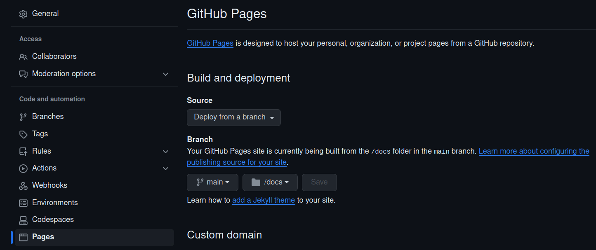

This provides an example of deploying the [create_a_plot](../create_a_plot) Panel application to a webserver (e.g. 
GitHub Pages) via Pyodide alongside Ollama.

It is also possible to run this app via a Panel server. See [this README](../create_a_plot/README.md) for details.

* [Run webserver and Ollama locally](#run-webserver-and-ollama-locally)
* [Run local webserver with Ollama on Modal](#run-local-webserver-and-ollama-on-modal)
* [Run on GitHub Pages and Ollama Modal](#run-on-github-pages-and-ollama-on-modal)

## Run webserver and Ollama locally

#### 1. Create environment and start a local webserver

```bash
$ make env-create
$ mamba activate create_a_plot-pyodide
$ make env-update

$ make local-web-server
```

#### 2. Convert the panel app to Pyodide

```bash
$ make convert-panel-to-web
```

#### 3. Install Ollama and setup

See [this README](../create_a_plot/README.md) for details (section **Run Panel and Ollama locally** step 1).

#### 3. Try the app

Assuming the `app.py` code is pointing to the correct IP address for the Ollama service (e.g. http://localhost:11434), 
the app should now work: http://0.0.0.0:8000/docs/create_a_plot-pyodide/app.html

## Run local webserver with Ollama on Modal

Run a local webserver with `make local-web-server`.

To spin up an Ollama server listening via Modal, run `make modal-serve`. Once the Modal app has started, you local 
webserver should be able to connect to it (note with this script the URL in `app.py` takes the form `IP-ADDRESS`, not `IP-ADDRESS:11434`).

## Run on GitHub Pages and Ollama Modal

Spin up an Ollama server a per the previous section.

Once happy, git commit and push to GitHub. To enable GitHub Pages, go to `Settings > Pages`. In the 
**Build and deployment** section, set **Branch** to `main` and folder to `/docs`:



GitHub Actions will now deploy to GitHub Pages automatically on a `git push` to 
https://asmith26.github.io/panel-apps/create_a_plot-pyodide/app.html

> Note: May need to clear cache when viewing apps at https://asmith26.github.io/ (doesn't seem to be a problem when testing
   locally).