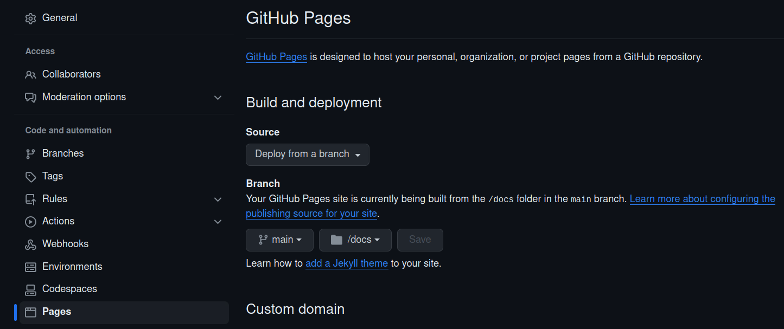

This provides an example of deploying a Panel application to GitHub Pages via Pyodide.

To test locally, run:

```bash
make env-create-from-lock
mamba activate hello_pyodide
make convert-panel-to-web
make local-web-server  # and navigate to http://0.0.0.0:8000/docs/hello_pyodide/app.html
```

Once happy, git commit and push to GitHub. To enable GitHub Pages, go to `Settings > Pages`. In the 
**Build and deployment** section, set **Branch** to `main`   and folder to `/docs`:



GitHub Actions will now deploy to GitHub Pages automatically on a `git push` to 
https://asmith26.github.io/panel-apps/hello_pyodide/app.html
